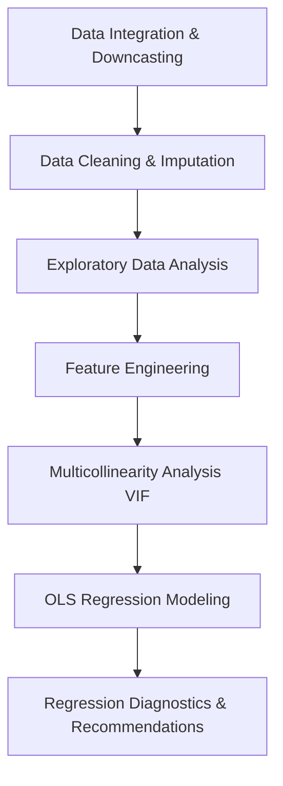

# Credit Risk Analytics & NPA Prediction

An end-to-end data analytics and predictive modeling project focused on credit risk assessment, data quality engineering, exploratory data analysis (EDA), feature engineering, and regression diagnostics for **Non-Performing Asset (NPA)** risk management. 

Using a massive dataset of **2,000,000 retail credit records** across 9 relational databases, this project models borrower behavior, identifies macro and micro risk drivers, and evaluates linear regression models to predict **Loss Given Default (LGD %)**.

---

## Project Structure & Workflow

The workflow of this project is structured into four main phases, as implemented in the master Jupyter Notebook [capstone_perform.ipynb](file:///c:/Users/Omkar/Downloads/Credit-Risk-Analytics-and-NPA-Prediction/capstone_perform.ipynb):



---

## 1. Data Acquisition, Integration & Cleaning

### Data Scale & Memory Optimization
The project integrates credit data from 9 separate relational files containing borrower profile, credit bureau, asset collateral, payment history, and regional economic factors:
- `loans_master.csv`
- `customer_bureau.csv`
- `loan_performance.csv`
- `payment_history.csv`
- `monthly_emi_track.csv`
- `loan_enquiry_bureau.csv`
- `collateral_assets.csv`
- `credit_card_behavior.csv`
- `branch_region_economy.csv`

To handle the scale of **2,000,000 rows** efficiently, the data integration pipeline downcasts data types (e.g., converting `int64` to `int32`/`int16` and `float64` to `float32`/`float16`). 
- **Master Joined Data Shape**: 2,000,000 rows, 182 columns
- **Orphan Records**: **0** (perfect key alignment across all relational files)
- **Parquet Storage Optimization**: The consolidated file is saved as `master_dataframe.parquet`, reducing disk storage to **417.81 MB** with accelerated load times.

---

### Cleaning Deliberate Data Quality Issues
Four significant deliberate anomalies in the source data were detected and programmatically resolved:

| Identified Data Quality Issue | Diagnosis | Resolution Action | Affected Records |
| :--- | :--- | :--- | :---: |
| **NPA Status Mismatch** | Defaulted loans (`loan_status == 1`) mistakenly flagged as performing (`npa_flag == 0`). | Forced `npa_flag = 1` for all defaulted loans. Set `dirty_flag = 1`. | 77,541 |
| **Zero Collateral Value** | Secured loans (`has_collateral == 1`) recorded with a collateral value of `0` INR. | Imputed collateral value with the median of valid positive secured assets. | 120,084 |
| **Invalid Rejection Rate** | Rejection rates exceeding physical limits (`rejection_rate_pct > 100%`). | Capped the invalid values at exactly `100%`. | 3,168 |
| **Age & Credit Hist. Mismatch** | Credit history duration longer than the borrower's age (`credit_hist_years > age`). | Capped credit history length at `age - 18` (min. 0). Set `dirty_flag = 1`. | 132,333 |

---

### Classification-Based Missing Value Imputation
Missing values in high-missingness columns were classified by their missingness mechanisms and imputed systematically:

*   **Months Since Last Delinquency (`mths_since_last_delinq`)** — *1,098,640 missing records*
    *   **Mechanism**: **MNAR** (Missing Not at Random). A missing value indicates that the customer has never experienced a delinquency.
    *   **Imputation**: Imputed with a constant **`-1`** and tracked with a new binary indicator column `mths_since_last_delinq_missing = 1`.
*   **Mortgage Accounts (`mort_acc`)** — *260,330 missing records*
    *   **Mechanism**: **MAR** (Missing At Random).
    *   **Imputation**: Imputed using the column **median**.
*   **Employment Length in Years (`emp_length_years`)** — *180,539 missing records*
    *   **Mechanism**: **MAR** (Missing At Random).
    *   **Imputation**: Imputed using the column **median**.
*   **Installment Utility Percentage (`il_util_pct`)** — *200,167 missing records*
    *   **Mechanism**: **MAR** (Missing At Random).
    *   **Imputation**: Imputed using the column **median**.

---

### Outlier Treatment via Winsorization
To prevent extreme values from distorting predictive regression models, the 6 most highly skewed numeric columns were Winsorized by clipping values at their **1st** and **99th** percentiles:

1.  **`collections_12mths_fee`** (Skew: 139.04) → Capped at `0.0` (p1) and `657.22` (p99)
2.  **`collection_recovery_fee`** (Skew: 125.77) → Capped at `0.0` (p1) and `2910.98` (p99)
3.  **`recoveries_inr`** (Skew: 94.23) → Capped at `0.0` (p1) and `40329.10` (p99)
4.  **`emi_advance_paid_inr`** (Skew: 59.17) → Capped at `0.0` (p1) and `40329.10` (p99)
5.  **`expected_loss_inr`** (Skew: 27.01) → Capped at `0.0` (p1) and `3990.42` (p99)
6.  **`avg_cur_bal_inr`** (Skew: 25.66) → Capped at `47.52` (p1) and `44732.77` (p99)

---

## 2. Exploratory Data Analysis (EDA) Insights

*   **Class Imbalance**: Out of 2,000,000 loans in the master dataset, **96.1% are performing** (1,922,444 loans) and **3.9% are defaulted/NPAs** (77,556 loans). 
*   **CIBIL Distribution**: Performing borrowers show a distribution skewed heavily toward high credit scores (700+), while defaulted borrowers exhibit a flattened, broader distribution concentrated at lower scores.
*   **Key Risk Drivers**: Boxplots show that defaulted loans systematically feature:
    *   Higher Interest Rates (`int_rate_pct`)
    *   Higher Debt-to-Income (`dti_pct`) ratios
    *   Lower Annual Incomes (`annual_inc_inr`)
    *   Higher credit utilization ratios (`revol_util_pct`)
*   **Credit Quality Grading**: Default rates climb monotonically across credit grades. Grade A loans exhibit the lowest default rate (<1%), while Grade G loans show a default rate exceeding 15%.
*   **Temporal & Macroeconomic Trends**:
    *   Default rates spiked significantly in **2020** to **1.79%** (compared to a non-COVID average of **1.54%**) due to pandemic-related disruptions.
    *   A dual-axis overlay of the RBI Repo Rate and default rates demonstrates that high-rate environments increase the repayment burden, leading to an increase in defaults with a short temporal lag.

> [!NOTE]
> **The Loss Given Default (LGD) Paradox:**
> A crucial statistical finding is that CIBIL score is heavily correlated with whether a customer defaults (Probability of Default - PD), but has **zero correlation with Loss Given Default (LGD %)** on defaulted loans (**r = 0.0018**, p-value = 0.623). Once a default occurs, credit bureau history does not predict what percentage of the asset the bank will lose. LGD is instead driven by collateral liquidation, recovery policies, and macroeconomics.

---

## 3. Feature Engineering

To capture non-linearities and credit relationships, 13 complex features were engineered and evaluated against LGD:

### A. Repayment-Burden Features
*   **`emi_to_income_ratio`**: Monthly installment relative to monthly income.
    $$\text{EMI to Income Ratio} = \frac{\text{installment\_inr}}{\text{annual\_inc\_inr} / 12}$$
*   **`loan_to_income_ratio`**: Total loan amount relative to annual income.
    $$\text{Loan to Income Ratio} = \frac{\text{loan\_amnt\_inr}}{\text{annual\_inc\_inr}}$$
*   **`rate_spread_pct`**: Spread over the central bank policy rate (Strongest correlation with LGD: **0.0795**).
    $$\text{Rate Spread \%} = \text{int\_rate\_pct} - \text{rbi\_repo\_rate\_pct}$$
*   **`real_interest_rate`**: Real interest rate adjusted for CPI inflation.
    $$\text{Real Interest Rate} = \text{int\_rate\_pct} - \text{cpi\_inflation\_pct}$$

### B. Bureau-Behavior Features
*   **`credit_util_composite`**: A weighted credit utilization index focusing on revolving and bankcard accounts.
    $$\text{Credit Util Composite} = 0.5 \times \text{revol\_util\_pct} + 0.3 \times \text{bc\_util\_pct} + 0.2 \times \text{all\_util\_pct}$$
*   **`delinq_severity_score`**: Historical delinquency rate weighted by recency.
    $$\text{Delinq Severity} = \text{delinq\_2yrs} \times \left(1 + \frac{1}{\max(1, \text{mths\_since\_last\_delinq})}\right)$$
*   **`enq_velocity_score`**: Inquiry frequency heavily weighting recent 30-day activity.
    $$\text{Enquiry Velocity} = \text{num\_enquiries\_30d} \times 4 + \text{num\_enquiries\_90d}$$

### C. Income and Collateral Features
*   **`income_stability_ratio`**: Income adjusted for job tenure.
    $$\text{Income Stability} = \frac{\text{annual\_inc\_inr}}{\text{emp\_length\_years} + 1}$$
*   **`credit_depth_score`**: Total credit accounts relative to history length.
    $$\text{Credit Depth} = \frac{\text{total\_acc}}{\text{credit\_hist\_years} + 1}$$
*   **`collateral_coverage_ratio`**: Asset coverage relative to loan amount.
    $$\text{Collateral Coverage} = \frac{\text{collateral\_value\_inr}}{\text{loan\_amnt\_inr} + 1}$$

### D. Skew Reduction & Macro Context
*   **`log_annual_inc`** & **`log_loan_amnt`**: Log-transformed financial variables to stabilize variance.
*   **`covid_issue_year_flag`**: Binary flag indicating whether the loan was issued in 2020. An independent t-test verified that COVID-era defaulted loans had a significantly higher mean LGD (**1.79%** vs **1.54%** overall, **t-statistic: 10.63, p-value: 0.0000**).

---

## 4. Regression Modeling & Diagnostics

### Multicollinearity Analysis
To satisfy OLS assumptions, Variance Inflation Factors (VIF) were calculated across candidate features. An initial model showed severe multicollinearity. Four variables were dropped to resolve this:

*   **Dropped Variables**: `rate_spread_pct` (VIF: 7.82), `log_annual_inc` (VIF: 2.44), `log_loan_amnt` (VIF: 2.34), `open_acc` (VIF: 2.35).
*   **Result**: All retained features successfully dropped to VIF levels **< 6.0** (with highest being `emi_to_income_ratio` at 5.74).

#### VIF Comparison Table

| Feature | Initial VIF | Retained VIF |
| :--- | :---: | :---: |
| **`const`** | 912.66 | 137.93 |
| **`cibil_score`** | 1.00 | 1.00 |
| **`age`** | 1.03 | 1.03 |
| **`dti_pct`** | 1.00 | 1.00 |
| **`total_acc`** | 2.61 | 1.26 |
| **`emp_length_years`** | 1.18 | 1.12 |
| **`ltv_ratio_pct`** | 1.40 | 1.28 |
| **`collateral_score`** | 1.00 | 1.00 |
| **`loan_term_months`** | 1.28 | 1.28 |
| **`emi_to_income_ratio`** | 5.74 | 5.74 |
| **`loan_to_income_ratio`** | 7.09 | 5.66 |
| **`real_interest_rate`** | 7.71 | 1.01 |
| **`credit_util_composite`** | 1.00 | 1.00 |
| **`delinq_severity_score`** | 1.00 | 1.00 |
| **`enq_velocity_score`** | 1.00 | 1.00 |
| **`income_stability_ratio`** | 1.72 | 1.19 |
| **`credit_depth_score`** | 1.30 | 1.30 |
| **`collateral_coverage_ratio`** | 1.28 | 1.17 |
| **`covid_issue_year_flag`** | 1.15 | 1.00 |
| *`rate_spread_pct`* | *7.82* | *Dropped* |
| *`log_annual_inc`* | *2.44* | *Dropped* |
| *`log_loan_amnt`* | *2.34* | *Dropped* |
| *`open_acc`* | *2.35* | *Dropped* |

---

### Baseline OLS Regression Model & Diagnostics
An Ordinary Least Squares (OLS) regression model was fitted on defaulted loans ($N = 77,556$) to predict `lgd_pct`:

```
                                 OLS Regression Results
==============================================================================
Dep. Variable:                lgd_pct   R-squared:                       0.000
Model:                            OLS   Adj. R-squared:                 -0.000
Method:                 Least Squares   F-statistic:                    0.9043
Prob (F-statistic):             0.590   Log-Likelihood:            -3.4231e+05
No. Observations:               77556   AIC:                         6.847e+05
Df Residuals:                   77533   BIC:                         6.849e+05
Df Model:                          22   
==============================================================================
```

> [!WARNING]
> **Key Modeling Insight:**
> The OLS model achieved an **R-squared of 0.000** and an F-statistic p-value of **0.590** (statistically insignificant). This indicates that **linear models of borrower risk metrics are ineffective for predicting LGD**. 
> While bureau and financial profile features can predict the *occurrence* of default (PD), they do not capture the post-default recovery rates (LGD) which are driven by asset liquidation efficiency, collection agency quality, and recovery duration.

#### OLS Diagnostic Indicators
*   **Residual Normality**: The Omnibus statistic (**4,458.99**, p-value = 0.00) and Jarque-Bera statistic (**2,494.49**, p-value = 0.00) indicate that residuals are highly non-normal.
*   **Autocorrelation**: The Durbin-Watson statistic is **1.995**, indicating that residuals do not show significant autocorrelation.
*   **Numerical Instability**: The high Condition Number (**6.35e+06**) suggests remaining scaling issues (e.g., mixing raw currency values in INR with ratio and percentage metrics), indicating OLS is numerically unstable.

---

## NPA Management Recommendations

1.  **Decouple PD and LGD Modeling**: Do not use credit bureau scores (e.g. CIBIL) to evaluate post-default losses. CIBIL is excellent for predicting PD, but has no linear relation to LGD.
2.  **Focus on Collateral Valuations**: Shift focus to high-fidelity collateral valuation, legal recovery channels, and asset-backed structural features (like LTV ratio and collateral coverage) when modeling LGD.
3.  **Deploy Non-Linear Models**: OLS struggles with LGD due to extreme values and zero-inflation (many defaults yield either 0% or 100% loss). Advanced models like Two-Stage (Tobit) models, Beta Regressions, or Tree-Based ensemble algorithms (Random Forest, XGBoost) should be used instead of standard linear regression.